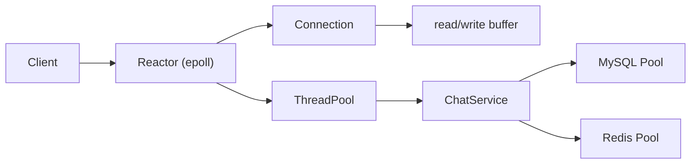

# miniWebChat

> 基于 **Reactor（epoll）模型** 的高并发聊天室服务器，采用 **线程池 + MySQL + Redis** 实现 I/O 与业务解耦，支持用户登录与世界聊天室实时消息广播。

## 项目简介

miniWebChat 是一个面向高并发场景设计的简化版聊天室服务端项目，使用 C++17 实现。

**项目采用：**

* **Reactor 模型** 处理网络事件
* **线程池** 处理业务逻辑
* **MySQL** 完成用户认证
* **Redis** 缓存用户状态与聊天记录


## 项目功能

* 用户登录（MySQL 校验）
* 世界聊天室（所有用户共享）
* 实时消息广播
* JSON 协议通信（长度头 + JSON）
* 非阻塞 I/O（epoll）
* 多线程业务处理（线程池）
* Redis 缓存：

  * 用户信息
  * 在线状态
  * 聊天记录（内存级缓存）


## 项目结构

```id="l9y9c2"
miniWebChat/
├── src/
│   ├── main.cpp
│   ├── chat_server        # 可执行文件
│   └── pool/
│       ├── MySQLConnection.cpp
│       ├── MySQLConnectionPool.cpp
│       ├── RedisConnection.cpp
│       └── RedisConnectionPool.cpp
│
├── include/
│   ├── common/
│   │   ├── Server.hpp
│   │   ├── Reactor.hpp
│   │   ├── Connection.hpp
│   │   ├── ChatService.hpp
│   │   └── Protocol.hpp
│   │
│   └── pool/
│       ├── ThreadPool.hpp
│       ├── BlockingQueue.hpp
│       ├── MySQLConnectionPool.hpp
│       └── RedisConnectionPool.hpp
│
├── build/                 # 编译中间文件
├── Makefile
└── README.md
```

## 编译与运行

### 1. 编译

```bash id="qq7ypv"
make
```


### 2. 启动服务端

```bash id="rd9l6v"
./src/chat_server
```


### 3. 启动依赖服务

```bash id="4tqv1x"
sudo service mysql start
sudo service redis-server start
```


### 4. 初始化数据库

```sql id="bq4p4m"
CREATE TABLE users (
    id INT PRIMARY KEY AUTO_INCREMENT,
    username VARCHAR(32) NOT NULL UNIQUE,
    password VARCHAR(64) NOT NULL
);
```

插入测试用户：

```sql id="ny1zqk"
INSERT INTO users (username, password) VALUES
('alice', '123456'),
('bob', '123456'),
('charlie', '123456');
```


### 客户端测试

```bash id="7x4cpm"
python3 client.py alice 123456
```


## 系统架构



## 核心模块

### 1. Reactor（网络核心）

* 基于 epoll 实现 I/O 多路复用
* 单线程处理：

  * accept
  * read / write
  * 事件分发
* 支持 LT / ET 模式


### 2. Connection（连接管理）

* 每个客户端一个 Connection 对象
* 管理：

  * socket fd
  * 读缓冲（readBuffer）
  * 写缓冲（writeBuffer）
* 负责粘包/半包处理

### 3. ThreadPool（线程池）

* 处理业务逻辑：

  * JSON 解析
  * 登录校验
  * 消息分发
* 避免 Reactor 阻塞


### 4. ChatService（业务核心）

* 统一业务入口
* 处理消息类型：

  * login_req
  * chat_req
* 调用：

  * MySQL 校验登录
  * Redis 缓存用户状态
* 构造响应：

  * login_resp
  * chat_broadcast
  * error


### 5. Protocol（协议层）

* 应用层协议：

  ```
  [4字节长度头][JSON正文]
  ```
* 负责：

  * 拆包 / 粘包处理
  * JSON 解析

### 6. MySQL（数据存储）

* 存储用户账号信息
* 用于登录认证

### 7. Redis（缓存层）

缓存内容：

* 用户信息：

  ```
  chat:user:<username>
  ```
* 在线状态：

  ```
  online = 1 / 0
  ```
* 聊天记录：

  ```
  chat:world:<timestamp>:<user_id>
  ```
